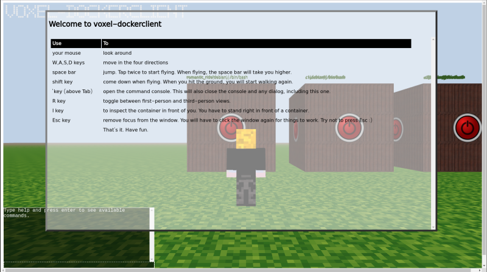

## How to use voxel-dockerclient
This is the opening screen of voxel-dockerclient.

Press the **\`** key to close the dialog. The same key can be used to open and close the command console, and to close any dialog.

At this point, you should see all your containers, arranged left to right from the oldest to the newest. Running or stopped is indicated by lights on the container.

Look around with your mouse. Move the player around with the WASD keys. The space bar makes the player jump. Double-tapping the space bar makes the player fly.

While flying, the space bar takes the player higher, and the shift key lower. Once the player hits the ground, running will start again.

Open the command console, and try the commands. Currently, the following commands are available:

<table><thead><tr><th>Command</th><th>Description</th></tr></thead><tbody><tr><td>help</td><td>Shows all available commands</td></tr><tr><td>inspect</td><td>Inspects a container</td></tr><tr><td>top</td><td>Shows processes running in a container</td></tr><tr><td>start</td><td>Starts a container</td></tr><tr><td>stop</td><td>Stops a container</td></tr><tr><td>go</td><td>Takes player to a container, or to the first or last container. Type go home if you get lost.</td></tr><tr><td>remove</td><td>Deletes a container</td></tr><tr><td>create</td><td>Creates a container</td></tr><tr><td>welcome</td><td>Shows the welcome message</td></tr><tr><td>refresh</td><td>Re-fetches container list</td></tr><tr><td>restart</td><td>Restarts voxel-dockerclient. Use as a last resort.</td></tr></tbody></table>

Of these, the container-related commands like `start`, `stop`, `top`, `remove` and `inspect` can be invoked in two ways: either by using the `<command> <containername>` syntax, or by positioning the player exactly next to a container, and using just `<command>`.

When the command console is closed, pressing the **I** key will invoke the `inspect` command. If the player is exactly next to a container, that container will be inspected.

The `create` command allows you to create new containers. Currently, you can only use images already on your docker host. Image pulling will be added in a later release.

Activity performed in other clients, such as the official docker client, will not reflect automatically in voxel-dockerclient. Use the `refresh` command periodically.

The `go` command can be used to teleport the player to a particular container, using the syntax `go <containername>`. `go home` will teleport to the first (oldest) container. `go nextslot` will teleport to the spot where the next new container will appear. 

